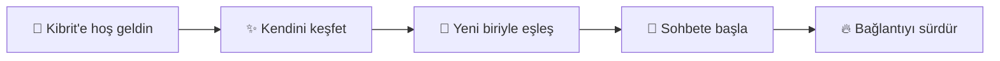

# 🔥 Kibrit

<p align="center">
  
</p>

<p align="center">
  <strong>Yeni insanlarla tanışmayı daha kolay, samimi ve hızlı hâle getiren modern tanıtım sayfası.</strong>
</p>

<p align="center">
  <a href="https://github.com/kaangercek/Kibrit-web"></a>
  
  
  
</p>

## ✨ Proje hakkında

Kibrit, insanların yeni kişilerle tanışmasını ve hızlıca sohbete başlamasını anlatan, mobil uyumlu tek sayfalık bir web arayüzüdür. Tasarım; sıcak renk paleti, güçlü tipografi, yuvarlatılmış kartlar ve dikkat çekici çağrı butonları üzerine kuruludur.

> **Kibrit ile yeni bir sohbete ulaşmak sadece birkaç saniye.**

## 🎯 Öne çıkan bölümler

| Bölüm | Açıklama |
| --- | --- |
| 🏠 Hero alanı | Kibrit’in ana fikrini ve uygulama ekranını öne çıkarır. |
| 💬 Nasıl çalışır? | Kullanıcının tanışma sürecini adım adım anlatır. |
| ⚡ Özellikler | Hızlı eşleşme, kolay kullanım ve samimi deneyim vurgulanır. |
| 📱 Uygulama tanıtımı | Kibrit uygulamasının görsel kimliğini destekler. |
| 🚀 Çağrı alanı | Kullanıcıyı Kibrit’i keşfetmeye yönlendirir. |

## 🔄 Kullanıcı akışı



## 🛠️ Kullanılan teknolojiler

- **HTML5** — semantik ve erişilebilir sayfa yapısı
- **CSS3** — özel renkler, animasyonlar ve responsive stiller
- **Bootstrap 5** — grid sistemi ve yardımcı sınıflar
- **Google Fonts / Poppins** — modern tipografi
- **SVG ikonlar** — hafif ve keskin arayüz ikonları

## 📁 Klasör yapısı

```text
Kibrit-web/
├── index.html          # Ana Kibrit tanıtım sayfası
├── solution.html       # Referans/alternatif tasarım sayfası
├── css/
│   ├── style.css       # Ana sayfa stilleri
│   └── solution.css    # Alternatif sayfa stilleri
├── images/
│   ├── kibrit-logo.png
│   └── iphone2.png
└── goal images/        # Tasarım hedefi için referans görseller
```

## 🚀 Çalıştırma

1. Projeyi klonlayın:

   ```bash
   git clone https://github.com/kaangercek/Kibrit-web.git
   cd Kibrit-web
   ```

2. `index.html` dosyasını tarayıcıda açın.

   İsterseniz VS Code içindeki **Live Server** ile de çalıştırabilirsiniz.

## 🎨 Tasarım dili

```text
Ana fikir       →  sıcak, sosyal ve enerjik
Renk yaklaşımı  →  turuncu/amber vurgu + açık arka plan
Tipografi       →  Poppins, güçlü başlıklar
Şekiller        →  yuvarlatılmış kartlar + yumuşak gölgeler
Deneyim         →  mobil öncelikli, sade ve hızlı
```

## 📌 Geliştirme fikirleri

- [ ] Gerçek eşleşme ve mesajlaşma altyapısı eklemek
- [ ] Uygulama mağazası bağlantılarını aktifleştirmek
- [ ] Dark mode desteği eklemek
- [ ] Form doğrulama ve erişilebilirlik kontrollerini genişletmek
- [ ] GitHub Pages üzerinde canlı yayınlamak

## 📄 Lisans

Bu proje eğitim ve portföy çalışması amacıyla hazırlanmıştır.

---

<p align="center">🔥 <strong>Bir kıvılcım, yeni bir bağlantının başlangıcı olabilir.</strong></p>
